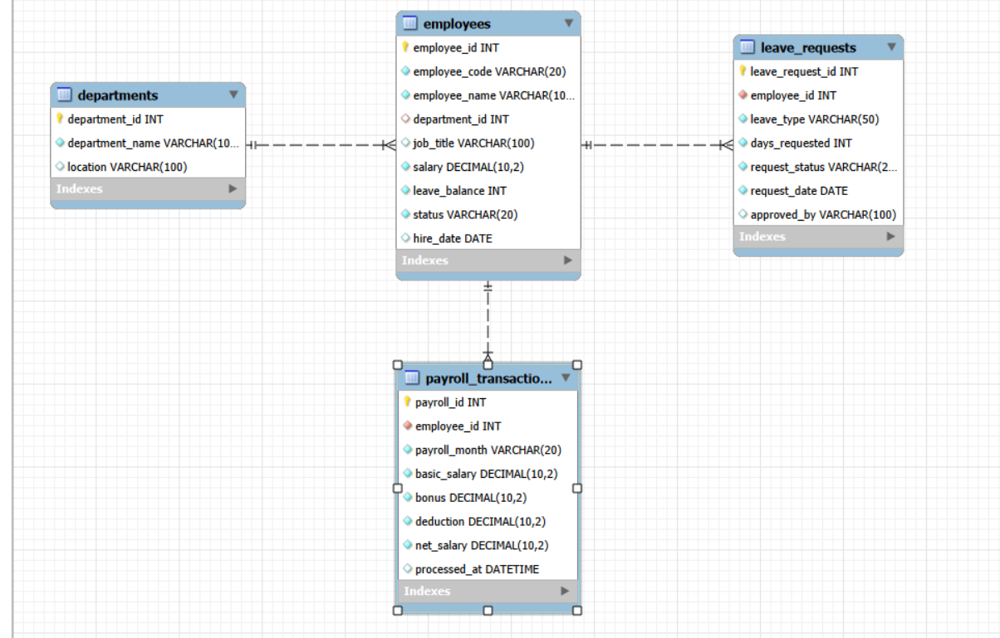

# HR Database ACID Principles Demonstration

This repository contains a MySQL database script and an Entity-Relationship (ER) diagram designed to demonstrate the core concepts of **ACID properties (Atomicity, Consistency, Isolation, Durability)** within an HR Management Context.

---

## Entity-Relationship (ER) Diagram

---

## Database Architecture & Schema

The database consists of 4 main tables structured as follows:

* **`departments`**: Stores department details (`HR`, `IT`, `Finance`, `Admin`, `Operations`).
* **`employees`**: Central master table for employee information including payroll status and leave balances.
* **`payroll_transactions`**: Logs historical payroll distributions.
* **`leave_requests`**: Tracks employee leave applications and status.

---

## ACID Test Scenarios Demonstrated

### 1. Atomicity (All or Nothing)
* **Scenario**: Processing a leave request.
* **Demonstration**: Inserting a record into `leave_requests` and deducting the `leave_balance` from the `employees` table simultaneously. If any step fails (e.g., due to an invalid foreign key), the whole transaction is rolled back using `ROLLBACK`.

### 2. Consistency (Data Integrity)
* **Scenario**: Database constraint validation.
* **Demonstration**: Enforcing business rules via `CHECK` constraints (e.g., preventing `leave_balance` or `salary` from dropping below 0). Transactions attempting to violate these rules are systematically rejected.

### 3. Isolation (Independent Execution)
* **Scenario**: Concurrent transaction handling.
* **Demonstration**: Simulating two concurrent user sessions with `READ COMMITTED` isolation level. It proves that Session 2 cannot see the uncommitted data modifications being performed by Session 1 until an explicit `COMMIT` is executed.

### 4. Durability (Permanent Storage)
* **Scenario**: Safe payroll records.
* **Demonstration**: Committing a transaction ensures that the written payroll logs remain persistent in the storage system, even if the server connection restarts immediately afterward.

---

## How to Run the Project

1. Open **MySQL Workbench** or any preferred MySQL client.
2. Clone or copy the contents of `hr_acid_db.sql`.
3. Execute sections **0 to 3** to initialize the schema and populate sample data.
4. Execute the ACID test blocks sequentially to observe transactional behaviors.
>  *Note: Testing **Isolation (Section 6)** requires opening two separate connection windows/sessions in your SQL client.*
